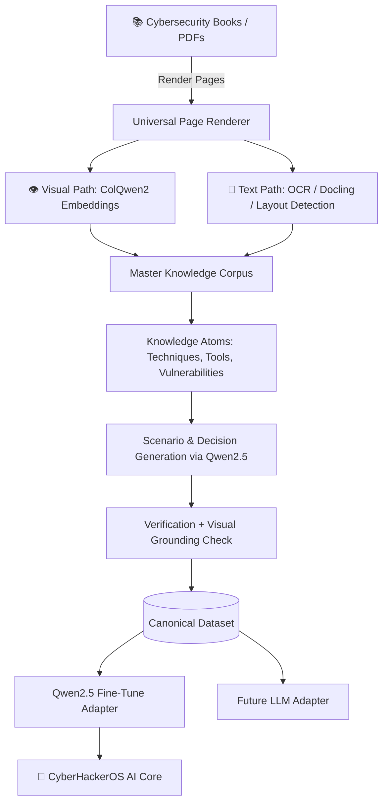

# ☠️ CyberHackerOS

**An AI-Native Operating System — Kali Linux Core, Integrated with LLMs & Strict Guardrails**

---

## 📖 What is CyberHackerOS?

**CyberHackerOS** is a custom AI-native operating system built directly on top of the latest **Kali Linux Rolling** release. It is not a standard Kali distro with tools bolted on. It is a deeply integrated platform where **Large Language Models (LLMs)** and **agentic AI pipelines** are first-class citizens of the OS itself — not applications running on top of it.

LLMs and vision-language models are integrated into the Kali Linux core and exposed as native OS services. Every AI agent that has access to OS-level capabilities operates under **strict, non-negotiable guardrails** — preventing unauthorized actions, data exfiltration, and destructive commands unless explicitly permitted in a controlled, authorized lab environment.

> **Designed for:** Authorized cybersecurity research, penetration testing labs, CTF practice, defensive tooling, and AI-augmented red/blue team operations.

---

## 🧠 LLM & AI Integration

CyberHackerOS embeds AI at the OS level through the following stack:

| Layer                 | Technology               | Role                                                   |
| :-------------------- | :----------------------- | :----------------------------------------------------- |
| **Primary Text LLM**  | `Qwen2.5-7B-Instruct`    | Decision-making, scenario reasoning, knowledge Q&A     |
| **Primary VLM**       | `Qwen2.5-VL-7B-Instruct` | Full-page visual extraction, diagram understanding     |
| **Visual Indexer**    | `ColQwen2 / ColPali`     | Layout-aware multi-vector page embeddings              |
| **Visual Base Model** | `Qwen2-VL-2B-Instruct`   | Required by ColQwen2 backbone                          |
| **OCR Engine**        | `Unlimited-OCR (Baidu)`  | Infinite-length document parsing                       |
| **Vector Store**      | `Qdrant`                 | Multi-vector MaxSim retrieval with binary quantization |
| **Agentic Framework** | `LangGraph + LangChain`  | Tool-calling pipelines integrated as OS services       |

All models run **100% locally** — zero cloud APIs required. Optimized for an NVIDIA RTX 5060 (8 GB VRAM) with phase-scheduled GPU loading to avoid OOM errors.

---

## 🛡️ Guardrails — Built Into the Core

Every AI agent on CyberHackerOS operates with **strictly enforced guardrails** baked into the OS service layer:

- **Authorization checks** — Agents cannot execute against targets outside an explicitly declared scope.
- **Non-destructive defaults** — Destructive actions (file deletion, payload deployment, privilege escalation) require explicit human confirmation even with root access.
- **Audit logging** — Every agentic action is logged to a tamper-evident local audit trail.
- **Scope-limited tool calls** — LangGraph pipelines run inside sandboxed execution contexts that enforce network, filesystem, and process constraints.
- **Ethical use enforcement** — The system is architecturally designed for authorized environments: CTF labs, personal test machines, and systems the user has legal permission to operate against.

---

## ⚙️ The Knowledge Engine — CyberX Dataset Factory

The AI intelligence powering CyberHackerOS is trained on knowledge produced by the **CyberX Dataset Factory** — a fully local, automated pipeline that ingests cybersecurity textbooks and produces structured training data.

### How it works

Unlike standard RAG pipelines that flatten PDFs into linear text, the factory treats **every page as a visual object first**. This preserves the spatial relationships between diagrams, tables, callouts, and code blocks that plain text extraction destroys.

### Key pipeline features

| Feature                              | Description                                                                                                      |
| :----------------------------------- | :--------------------------------------------------------------------------------------------------------------- |
| 👁️ **Visual-First Ingestion**        | Every page rendered at 200 DPI. ColQwen2 embeddings run unconditionally, independent of OCR.                     |
| 🔀 **Layout-Significance Routing**   | Pages are dynamically routed to standard OCR or full-page VLM extraction based on visual complexity.             |
| 🧠 **Decision-Making Datasets**      | Generates branching trajectories, constraint-aware scenarios, and negative examples — not Q&A memorization.      |
| 🤖 **Model-Agnostic Output**         | Canonical dataset format adapts to Qwen2.5, Llama, Gemma, or any future architecture.                            |
| ✅ **Visual Grounding Verification** | Generated training examples are verified against their source page's ColQwen2 embedding to catch hallucinations. |

---

## 🖥️ OS Customization

CyberHackerOS modifies the Kali Linux base at the ISO level:

- **Custom boot splash & GRUB menu** — Branded CyberHackerOS boot experience.
- **Native agentic services** — LangGraph pipelines registered as `systemd` services, available from the first shell session.
- **Modified UI/UX** — Tailored desktop environment tweaks for a focused security-research workflow.
- **Pre-loaded tooling** — All required Kali tools and AI models configured out-of-the-box.

---

## 📂 Documentation

- 📋 [**PRD**](prd.md) — Full product requirements for the dataset factory & OS integration.
- 🛠️ [**Tech Stack**](techstack.md) — Models, databases, and pipelines in detail.
- ⚠️ [**Constraints & Design Rules**](constraints.md) — VRAM limits, privacy mandates, and architectural guardrails.

---

## 🔒 Code Quality & Security

All commits are gated by a strict pre-push pipeline:

- `Ruff` — Python linting & formatting
- `Prettier / ESLint` — Web asset formatting
- `PMD` — Java anti-bloat checks
- `repo-secret-scan` — Full repo secret detection before every push

Run `setup-git2.ps1` to initialize local Git hooks after cloning.

---

_Built for authorized cybersecurity education, research, and AI-augmented operations._
_Not for unauthorized use._

