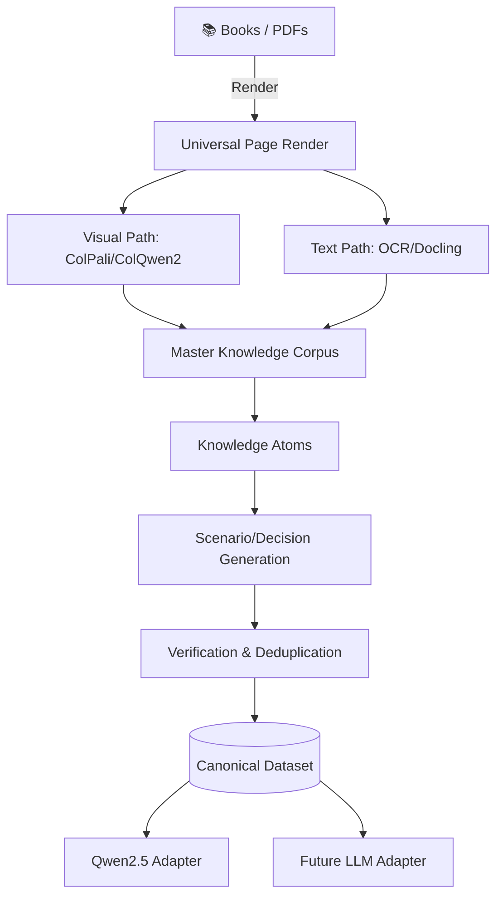

  

# CyberX Dataset Factory

**Fully Local, Automated Cybersecurity Knowledge & Training-Data Factory**

---

## 📖 Overview

The **CyberX Dataset Factory** (ColPali-Core Edition) ingests a massive collection of cybersecurity, hacking, and networking textbooks to automatically produce a **master multimodal knowledge corpus**, **canonical training datasets**, and a **layout-aware visual retrieval index**.

Unlike standard RAG systems that flatten PDFs into linear text, CyberX treats every page as a **visual object first**. It preserves the crucial spatial relationships between diagrams, tables, and text using **ColPali/ColQwen2** embeddings and full-page VLM extraction.

## ✨ Core Features

| Feature                      | Description                                                                                                    |
| :--------------------------- | :------------------------------------------------------------------------------------------------------------- |
| 👁️ **Visual-First Pipeline** | Parses every page natively as an image. Uses ColPali to generate layout-aware multi-vector embeddings.         |
| 🤖 **Model-Agnostic Output** | Generates a canonical dataset. Adapters translate this to specific formats (Qwen2.5, Llama, Gemma).            |
| 🔀 **Decision-Making Focus** | Generates branching trajectories, constraint-aware scenarios, and negative examples for tool selection.        |
| 🧠 **Intelligent Routing**   | Dynamically routes pages to standard OCR or full-page VLM extraction based on layout significance.             |
| 🛡️ **Fully Local & Private** | Requires zero cloud APIs. Optimized to run locally on consumer hardware (e.g., RTX 5060 8GB VRAM).             |
| 👑 **Super User Agent**      | The integrated AI agent operates with OS-level super user (root) access for unconstrained pipeline management. |

## 🏗️ Architecture

## 📂 Documentation

- 🛠️ [**Tech Stack**](techstack.md) - The specific models, databases, and pipelines powering the factory.
- ⚠️ [**Constraints & Design**](constraints.md) - Crucial VRAM limitations, privacy mandates, and architectural rules.
- 📋 [**Product Requirements Document (PRD)**](prd.md) - The full specification for the dataset factory.

## 🚀 Getting Started

_Coming soon: Instructions for initializing the GPU scheduler and running the ingestion pipeline._

## 🔒 Security & Code Quality

This repository enforces strict code quality and anti-bloat pipelines on all commits using `Ruff` (Python), `Prettier/ESLint` (Web), and `PMD` (Java). Ensure you run `setup-git2.ps1` to initialize the local Git hooks.
